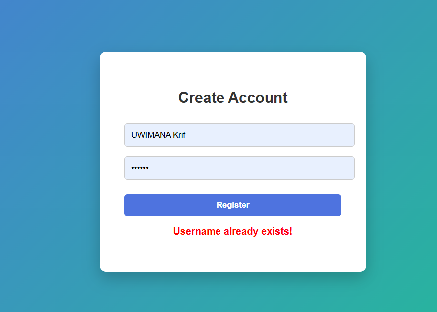
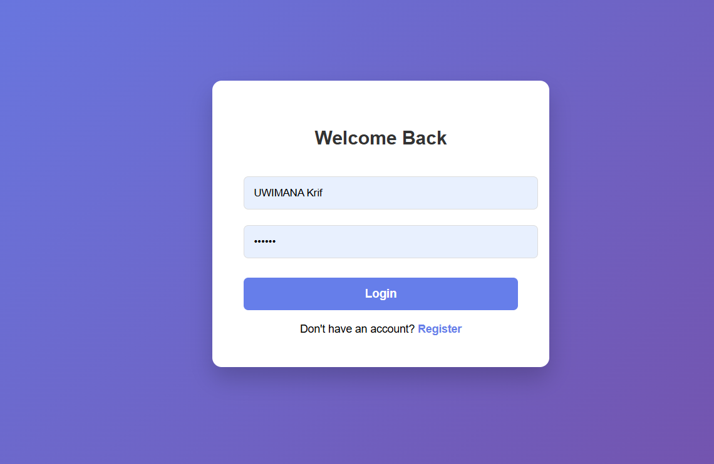
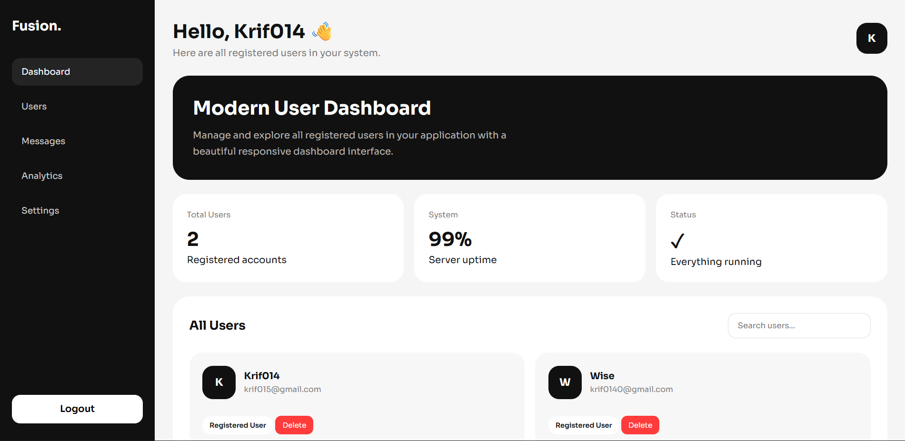
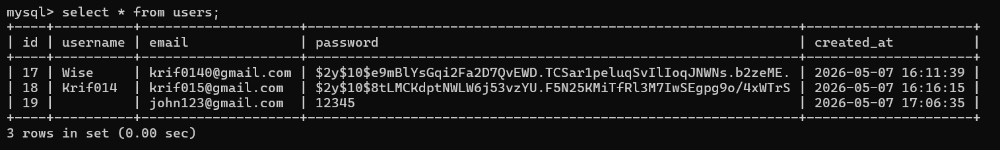

🔐 PHP Login, Registration & User Management System (CRUD API Included)

A modern PHP + MySQL authentication system with full user management + REST-style API.

🚀 Tech Stack

PHP (Backend)

MySQL (Database)

PDO + MySQLi

Apache (XAMPP)

HTML / CSS / JS

✨ Features

🔐 Authentication System

User registration

Secure login system

Password hashing (password_hash)

Session authentication

Logout system

📊 Dashboard

Protected dashboard (login required)

Displays all registered users

Search users in real-time

Clean responsive UI

⚙️ CRUD API (NEW)

Create user

Read users

Update user

Delete user

JSON responses

🧠 API Endpoints

📥 Get All Users

GET /Api.php

📥 Get Single User

GET /Api.php?id=1

➕ Create User

POST /Api.php

Body (JSON)

{

  "username": "john",

  "email": "<john@gmail.com>",

  "password": "123456"

}

✏️ Update User

PUT /Api.php

Body (JSON)

{

  "id": 1,

  "username": "john_updated",

  "email": "<newmail@gmail.com>"

}

❌ Delete User

DELETE /Api.php?id=1

🖼️ Project Preview

   
 
   

📁 Project Structure

krif-login/

│

├── db.php          # Database connection

├── register.php    # Registration page

├── login.php       # Login page

├── dashboard.php   # Protected dashboard

├── logout.php      # Logout system

├── Api.php         # CRUD API

📋 Requirements

PHP 7.4+

MySQL

Apache Server

XAMPP / WAMP / Laragon

⚙️ Installation Guide

1️⃣ Clone Repository

git clone https://github.com/YOUR-USERNAME/YOUR-REPO.git

2️⃣ Move to Server Folder

C:\xampp\htdocs\krif-login

3️⃣ Start Server

Start Apache

Start MySQL

4️⃣ Create Database

CREATE DATABASE krif_login;

USE krif_login;

CREATE TABLE users (

    id INT AUTO_INCREMENT PRIMARY KEY,

    username VARCHAR(50) NOT NULL UNIQUE,

    email VARCHAR(100),

    password VARCHAR(255) NOT NULL,

    created_at TIMESTAMP DEFAULT CURRENT_TIMESTAMP

);

5️⃣ Run Project

<http://localhost/krif-login/register.php>

🔄 How It Works

📝 Registration

User submits form

Password is hashed

Stored in database

🔐 Login

User credentials verified

Session created

Redirect to dashboard

📊 Dashboard

Shows all users

Protected route (requires login)

⚙️ API System

Full CRUD operations

JSON responses

Can be used with frontend apps

🛡️ Security Features

Password hashing

Prepared statements

Session authentication

Input escaping

Protected dashboard routes

🚀 Future Improvements

🔐 Role-based access (Admin / User)

🧾 Soft delete system

📊 Analytics dashboard

🔑 JWT authentication

📱 React frontend integration

🔍 Pagination + search API

🤝 Contributing

⭐ Star this repo

🍴 Fork it

📥 Submit pull requests

👤 Author

UWIMANA Krif
